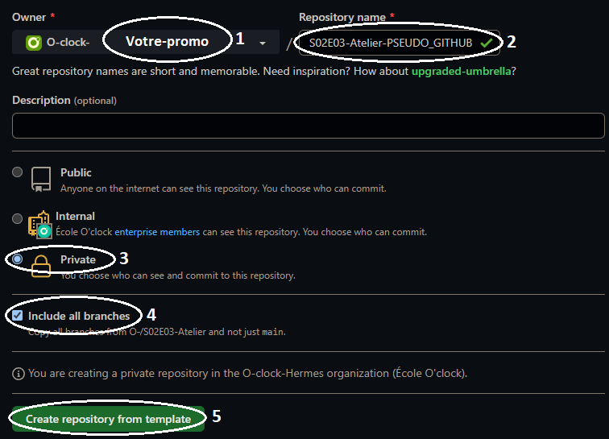

# Des profs passionnés

Les profs aussi sont passionnés. On a entrepris de créer une liste de leurs passions dans le fichier `profs_passions.md`.

Ce fichier ne contient que des titres **pour l'instant** 🤷

Mais... Il a déjà été rempli, par plusieurs personnes... Sur d'autres branches.

# 0️⃣ Étape 0 : Récupération d'un template avec toutes ses branches

L'atelier d'aujourd'hui est un peu particulier, on va devoir le récupérer manuellement pour obtenir toutes ses branches. Pour cela, nous allons utiliser la fonctionnalité "Template" de Github qui permet de créer un nouveau dépôt à partir d'un autre.

- Sur le repo de l'atelier, cliquer sur "Use this template"


- Sur l'interface suivante, suivre les étapes:

1. Choisir votre promo comme owner (et pas votre compte personnel)
2. Renseigner le nom du repo avec "S02E03-Atelier-PSEUDO_GITHUB" en remplaçant PSEUDO_GITHUB par votre pseudo github
3. **Private** doit être coché
4. Coche Include all branches / Inclure toutes les branches => Très important! Cela permet de copier toutes les branches d'un repository et pas uniquement la branche main/master.
5. Bien vérifier avant de cliquer sur "Create repository from template"



- Au clic, votre nouveau repo est créé et s'ouvre, vous pourrez le retrouver dans l'orga de votre promo ! 

# 1️⃣ Étape 1 : Récupérer et analyser le projet

#### 1. Analyser le projet sur github:
   - En haut à gauche, il est possible de voir les différentes branches disponibles
   - Le projet contient un fichier `profs_passions.md`, le fichier qui nous intéresse pour cet atelier

***

#### 2. Cloner ce dépot sur votre machine.

Voici comment s'y prendre :

```
git clone adresse-ssh-de-votre-depot-github
```

**💁 Bien remplacer adresse-ssh-de-votre-depot-github par l'adresse SSH de votre dépot Github.**

***

# 2️⃣ Étape 2 : Se déplacer entre les branches

Pour le moment, on est positionnés sur la branche `main`. C'est notre branche **maîtresse**, c'est sur elle qu'on va vouloir regrouper les branches que l'on aura validé.

***

#### 1. Exécuter la commande:

```
git branch
```

Étrange 🤔 ! On a vu sur github qu'il y avait plusieurs branches sur notre repo, mais le résultat du git branch n'en montre qu'une seule...

*C'est normal, par défaut, lorsqu'on fait un `git clone`, on ne récupère que la branche maîtresse (`main`) de notre projet sur notre machine.*


***

#### 2. Lister la totalité des branches (en local et à distance): 

```
git branch -r
```

Grâce à l'option `-r`, la liste des branches disponibles sur le **repo distant** s'affichent. 

Voir leur nom nous permet de nous déplacer entre les branches.

***

#### 4. Se déplacer sur l'une d'entre-elles:

```
git checkout passions_marion
```

Une fois cette commande exécutée, le fichier `profs_passions.md` affiche un contenu différent.

Analyser le contenu de `profs_passions.md` de la branche `passions_marion` et s'assurer que son contenu est cohérent.

Le but du jeu est de lister les branches à fusionner dans notre branche maîtresse (`main`) pour obtenir un fichier complet.

***

#### 5. Se déplacer dans chaque branche et analyser le contenu des fichiers.

***

#### 6. Se noter quelque part le nom de branches valides que l'on va pouvoir fusionner.

***

# 3️⃣ Étape 3 : Fusionner / Merger les branches valides

#### 1. Pour commencer, se positionner sur la branche maîtresse (`main`):

```
git checkout main
```

***

#### 2. Puis, exécuter la fusion grâce à la commande `git merge`, par exemple pour la branche `passions_marion`:

```
git merge passions_marion
```

***

#### 3. Vérifier sur vscode que le fichier profs_passions.md a bien pris en compte la fusion

***

#### 4. Fusionner dans `main` chaque branche notée à l'étape précédente

***

# 4️⃣ Étape 4 : Envoi au repo distant

#### 1. Vérifier sur Github que notre merge a bien fusionné les branches... Ah, non ? 

Étrange, on a mergé, pourquoi on ne voit pas apparaître la fusion sur notre projet ? 🤨

Lorsqu'on exécute une commande `merge`, la fusion n'a lieu que sur notre poste local, il faut indiquer à git que l'on souhaite l'envoyer sur notre repo distant !

Cet envoi au repo distant se fait grâce à la commande `git push`

***

#### 2. Transmettre la / les fusion(s) au repo distant en se positionnant sur la branche maîtresse (`main`) et en exécutant:

```
git push
```

***

#### 3. Vérifier sur Github, sur la branche `main`, le fichier `passions_profs.md` doit contenir toutes les fusions.

***

# Bonus

Une prof a oublié de faire sa liste avant de partir en vacances et nous l'a transmise par mail.

Votre mission, si vous l'acceptez, ajouter sa liste au projet en passant par une fusion de branche.

#### 1. Se positionner sur la branche `main` grâce à la commande `git checkout`

*Rappel: `git checkout` permet de se déplacer entre les branches*

#### 2. Créer une nouvelle branche et se positionner dessus grâce à la commande `git checkout -b`

*Rappel: `git checkout` avec l'option l'option `-b` permet de dire "je crée une nouvelle branche et je me positionne dessus!"*

#### 3. Modifier le fichier `profs_passions.md` en y ajoutant le texte transmis par Pauline:

```
🎮 : Finir Hades
🎮 : Débloquer tous les succès sur Isaac
📕 : Finir Fire & Blood
🎲 : Préparer une campagne de D&D
🧗‍♀️ : Réussir une voie en 6c
🎲 : Préparer une campagne de Aria
🗿 : Créer une figurine et la peindre
```

#### 4. Valider et enregistrer les modifications sur la branche grâce aux commandes `git add` et `git commit`

#### 5. Envoyer la branche sur le repo distant grâce à la commande `git push`

#### 6. Se positionner sur la branche `main` grâce à la commande `git checkout`

#### 7. Fusionner la nouvelle branche dans `main` grâce à la commande `git merge`

#### 8. Transmettre les modifications au repo distant grâce à la commande `git push`
# S02E03-Atelier-Ben
